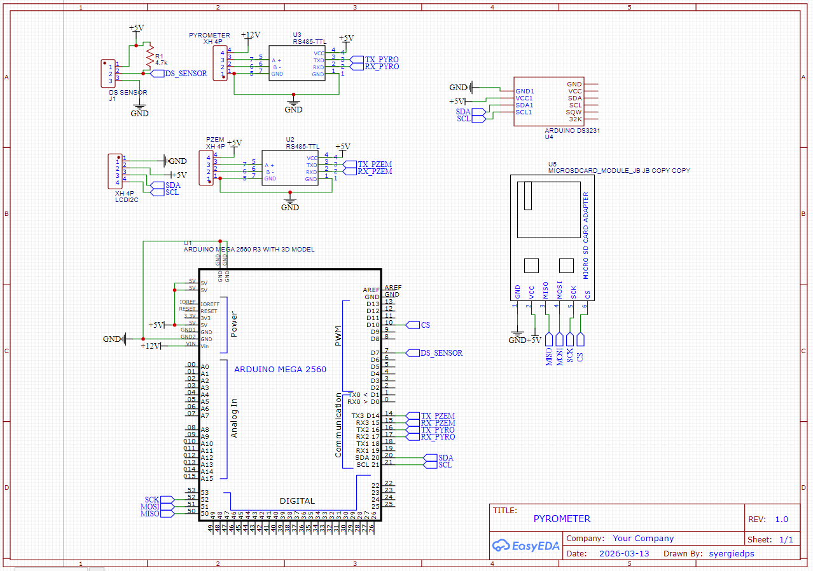
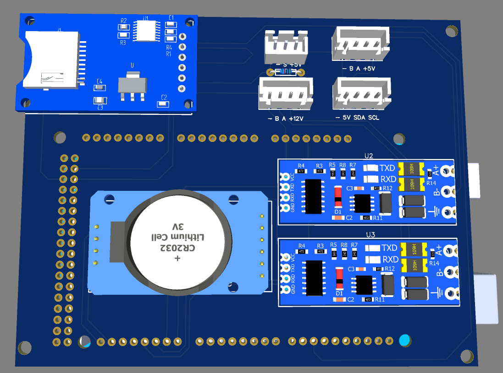

# ☀️ Pyrometer Temperature Monitoring
oleh : Husni dan Revan

Project ini digunakan untuk membaca data dari **pyrometer, PZEM DC, dan ds1303** menggunakan Arduino, kemudian menyimpan data untuk analisis.

## 📌 Fitur
- Membaca suhu secara real-time
- Membaca nilai radiasi secara real-time
- Membaca keluaran dari solar cell
- Simpan pengukuran per 1 menit di sd card
- Support komunikasi:
  - I2C (LCD I2C)
  - Modbus (industrial pyrometer, PZEM DC)

## 🧰 Library Requirements

Install dependency berikut:
- modbusmaster by doc Walker ver 1.0.0

Setelah diinstall buka C:/document/Arduino/Libraries/Modbusmaster lalu cari file modbusmaster.h dan ganti nilai parameter ini:
```bash
static const uint16_t ku16MBResponseTimeout          = 200; ///< Modbus timeout [milliseconds] 2000
```

- RTCLib by Adafruit ver 2.0.0


| Parameter     | Komponen terlibat       | Protokol              |
|--------------|------------|------------------------|
| Radiasi       | pyro sensor   | ModbusRTU   |
| Listrik       | PZEM sensor   | ModbusRTU   |
| Temperatur       | DS1303 | OneWire   |
| Interface    | LCD        | I2C          |
| Waktu     | RTC      | I2C        |
| Memori     | SD Card      | SPI        |


## Schematic
<p align="center">
  
  <br>
  <em>Figure 1. Pyrometer System Schematic</em>
</p>

## 3d Design
<p align="center">
  
  <br>
  <em>Figure 2. Pyrometer 3d Design</em>
</p>

## Upload Firmware
- upload firmware.ino
- Setting RTC bisa run script calibrator.py setelah firmware.ino di upload
- catatan : ketika kalibrasi RTC tidak ada serial monitor yang terbuka
